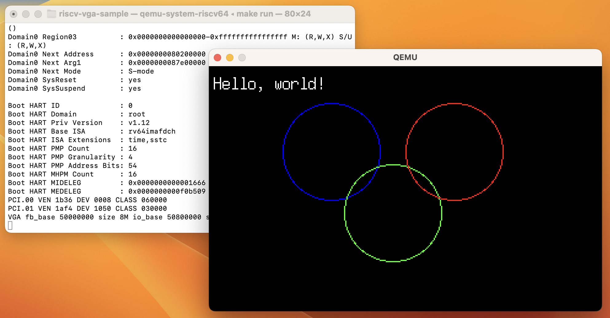

# RISCV VGA SAMPLE

**DO NOT USE IN THE ACTUAL PRODUCT**

- This is a sample of using VGA mode 13h on a QEMU RISC-V virt machine.



## REQUIREMENTS

- Rust (riscv64gc-unknown-none-elf)
  - `rustup target add riscv64gc-unknown-none-elf``
- qemu-system-riscv64

## HOW TO BUILD

```
$ cargo build --release
```

## HOW TO RUN

```
$ cargo run --release
```
